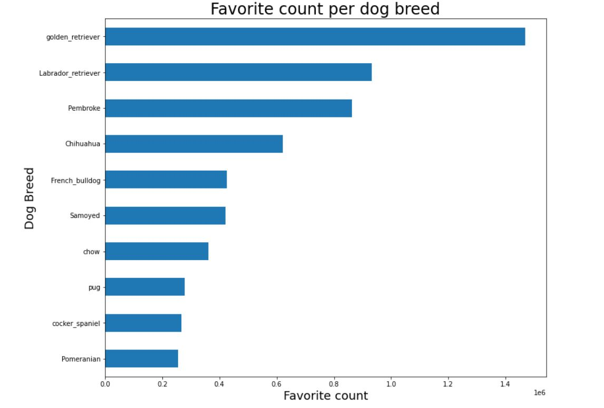

# Wrangling-Twitter-API

**In this project, I gather, assess, wrangle, and clean a dataset assembled from the Twitter channel "We rate dogs". I use Twitter API to query the text of the tweets and gather missing columns from the base dataset, and request a dataset with the associated predicted images. I use Python tools to assess any problems with the data. The result is a tidy and useful dataset of good quality data.**

## Project Tasks:
Tasks in this project are as follows:

### 1.  Data wrangling, which consists of:
-  Gathering data :  load existing dataset, use Twitter API to query tweets, use information extracted in JSON, request the images dataset from a website.
- Assessing data  :  assess data sources for "quality" and "tidiness" issues.
-  Cleaning data   : establish and execute actions for each of the quality and tidiness problems found.
### 2. Storing, analyzing, and visualizing wrangled data

### 3. Reporting on:
-  data wrangling efforts
-  data analyses and visualizations

## Insights:
## Breed popularity

The top five most popular breeds are `Golden Retriever`, `Labrador Retriever`, `Pembroke`, `Chihuahua`, and `Pug`. The top one, `Golden Retriever`, appears almost double and three times more than fourth and fifth places.

The breeds whose photos and related tweets were most retweeted were also, in order, `Golden Retriever`, `Labrador Retriever`, `Pembroke`, `Chihuahua`, but in fifth place is `Samoyed` which appears the seventh most mentioned breed. Pugs are more popular than they get retweeted.

`French bulldog` appears in the fifth place exceeding `Samoyed` which gets more retweeted than liked.

## Stage popularity
The most common stage mentioned is `pupper`, more than twice as high as those mentioned in the stage `doggo`, in turn twice as frequent as the least common stage `puppo`.

